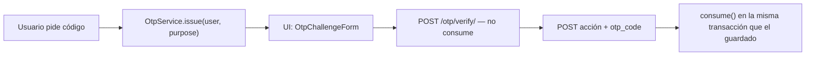
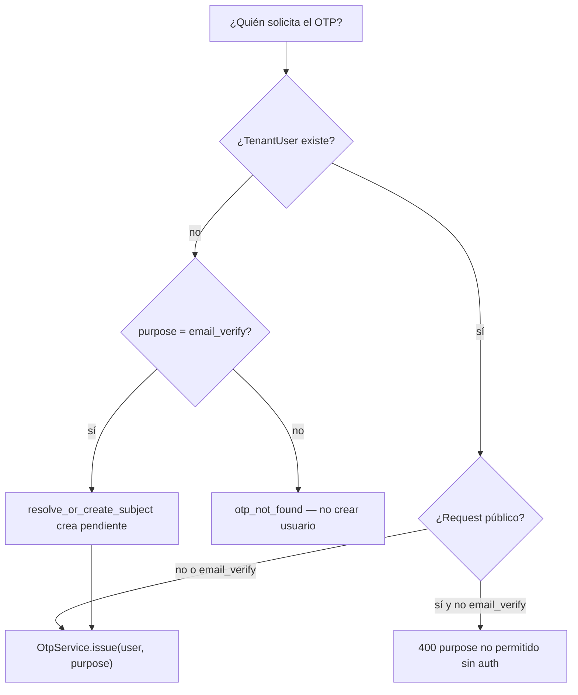

# Guía: añadir validación OTP a un feature nuevo

> Playbook para reutilizar la capa OTP **sin reimplementarla**.  
> Diseño: [`OTP_VALIDATION.md`](OTP_VALIDATION.md). Qué se construyó: [`OTP_IMPLEMENTATION.md`](OTP_IMPLEMENTATION.md).  
> Referencia viva: registro biométrico (`RegisterView` + `RegisterPage`).

Esta guía asume que `apps.otp` ya existe. Un feature nuevo **no** crea otra tabla de códigos, otro hasher ni otro envío de correo. Solo elige un `purpose`, pide el código, lo valida en UI y lo **consume** al persistir la acción.

---

## 1. Qué no tocar

| Pieza | Dónde | Rol |
|---|---|---|
| Emisión / verify / consume | `apps.otp.services.OtpService` | Única puerta de escritura de `OtpChallenge` |
| Request / verify HTTP | `POST /api/v1/otp/request/`, `/otp/verify/` | UI genérica |
| Mixin de guardado | `apps.otp.mixins.ConsumesOtpMixin` | Consume en la acción |
| Canal email | `apps.otp.channels.SmtpEmailChannel` | SMTP / console en dev |
| UI de 6 dígitos | `frontend/src/components/otp/OtpChallengeForm.tsx` | Reutilizable |

No copies lógica de hash, TTL o rate limit al consumidor. Si falta un comportamiento, extiende `OtpService` o el canal, no el endpoint del feature.

---

## 2. Contrato que todo feature debe respetar



Reglas fijas (no las renegocies por feature):

1. **`verify` ≠ `consume`.** La UI solo comprueba. El guardado es quien marca el código usado.
2. **El código va en el payload de la acción** (`otp_code`, 6 dígitos). No sustituyas eso por un flag del cliente ni por “ya pasó verify”.
3. **El desafío está atado a un `TenantUser` + `purpose`.** Un unlock no invalida un `email_verify`.
4. **Consume dentro de `transaction.atomic()` junto con el side-effect.** Si el guardado falla, el OTP debe seguir vivo (rollback).
5. **Momento de consume:** después de las validaciones caras o de negocio que no deben quemar el código (en registro: después del pipeline biométrico OK).

El cliente que salte la UI y mande `otp_code` directo al guardado **debe funcionar**: `consume` no exige `verified_at`.

---

## 3. Checklist (cópialo al ticket)

- [ ] ¿El usuario **ya existe**? Si no (como el registro), usa `email_verify` + `resolve_or_create_subject`. **No** crees pendientes para otros purposes.
- [ ] Elige o añade un `OtpChallenge.Purpose` (§4).
- [ ] ¿El `request` es público o autenticado? (§5). Hoy la API pública **solo** admite `email_verify`.
- [ ] Endpoint de la acción exige `otp_code` (regex `^\d{6}$`).
- [ ] Vista hereda `ConsumesOtpMixin` y setea `otp_purpose`.
- [ ] `consume_otp(user, otp_code)` corre **dentro** del `atomic()` del persist.
- [ ] UI: `OtpChallengeForm` + código **en memoria** (no `sessionStorage`).
- [ ] Hooks: ampliar `useOtp` si el purpose deja de ser solo `email_verify`.
- [ ] Plantilla de email `otp/<purpose>_subject.txt` + `otp/<purpose>.txt` (si no, cae al genérico `otp/code*`).
- [ ] Tests: issue no se pisa con otros purposes; consume falla → no hay side-effect; liveness/validación previa no quema el código.
- [ ] Regenerar `schema.json` + `bun run generate:api`.

---

## 4. Elegir `purpose`

Ya definidos en `OtpChallenge.Purpose`:

| Purpose | Uso | ¿Request público hoy? |
|---|---|---|
| `email_verify` | Registro / posesión del buzón | Sí (`UNAUTHENTICATED_PURPOSES`) |
| `step_up` | Confirmar una acción ya autenticada | No |
| `account_unlock` | Desbloqueo por intentos de suplantación | No |
| `email_change` | Confirmar el **nuevo** correo | No |
| `reenrollment` | Re-captura biométrica | No |

Añadir uno nuevo:

1. Valor en `OtpChallenge.Purpose` (migración de choices no es estrictamente necesaria en Django, pero documenta el valor).
2. **No** lo metas en `UNAUTHENTICATED_PURPOSES` salvo que el alta anónima sea el caso (hoy solo registro).
3. Plantillas `backend/apps/otp/templates/otp/<purpose>_subject.txt` y `<purpose>.txt`.
4. El rate limit 3/5 min es **por `(user, purpose)`**: unlock y email-verify no se restan entre sí.

Si la acción es “el usuario ya logueado confirma que sigue siendo él”, usa `step_up`. Si es un flujo de dominio concreto (unlock, cambio de email), usa el purpose específico para no invalidar un step-up en curso.

---

## 5. Quién puede pedir el código



**Hoy** `OtpRequestView` rechaza cualquier purpose fuera de `UNAUTHENTICATED_PURPOSES`. Para unlock / step-up / email_change hay dos caminos válidos:

**A — Endpoint autenticado de request (recomendado para step-up)**  
El usuario ya tiene JWT. El destino sale de `TenantUser.email`; **no** aceptes un email arbitrario en el body.

```python
# Vista nueva, p. ej. POST /api/v1/otp/request-authenticated/
user = request.tenant_user  # o lookup por claims del access token
result = OtpService().issue(user, OtpChallenge.Purpose.STEP_UP)
```

**B — Ampliar la API pública con cuidado**  
Solo si el usuario **no** puede autenticarse (cuenta bloqueada). Entonces:

1. Añade el purpose a un allowlist **distinto** (no reutilices el de registro).
2. Resuelve el usuario por `(application, email)` con `lookup_subject`.
3. **Nunca** crees un `TenantUser` nuevo.
4. Respuesta idéntica si el email no existe (`otp_not_found` genérico / 200 enmascarado si quieres anti-enumeración). El registro ya relaja enumeración porque el alta es el objetivo; unlock no debe confirmar que un email está enrolado.

---

## 6. Receta backend (consumidor)

Referencia: `apps/authentication/views.py::RegisterView`.

```python
from apps.otp.mixins import ConsumesOtpMixin
from apps.otp.models import OtpChallenge


class UnlockView(ConsumesOtpMixin, APIView):
    otp_purpose = OtpChallenge.Purpose.ACCOUNT_UNLOCK

    def post(self, request):
        data = serializer.validated_data
        user = lookup_subject(application=application, email=data["email"])
        # 1) Validaciones que NO deben quemar el OTP (estado, reglas de negocio).
        # 2) Consume + side-effect atómicos.
        with transaction.atomic():
            self.consume_otp(user, data["otp_code"])
            user.is_locked = False
            user.save(update_fields=["is_locked", "updated_at"])
        return Response({"ok": True})
```

Serializer de la **acción** (no el de `/otp/verify/`):

```python
otp_code = serializers.RegexField(
    regex=r"^\d{6}$",
    error_messages={"invalid": "El código debe ser de 6 dígitos."},
)
```

`OtpError` ya sale como `{code, message, field}` y `otp_rate_limited` lleva `Retry-After`. No hagas `except OtpInvalidError` para remapear salvo UX muy específica.

### 6.1 Orden dentro del request de guardado

```text
resolver usuario
→ validaciones baratas (app activa, usuario existe, no email_taken)
→ trabajo caro / pipeline (video, I/O)
→ atomic:
     consume_otp
     persistir el cambio de dominio
→ emitir tokens / respuesta
```

Si `consume` va **antes** del trabajo caro, un fallo posterior (liveness, unique) gasta el código. En registro se evitó a propósito.

### 6.2 Destino del mensaje

`OtpService.issue` toma el destino del usuario (`email` hoy; `phone` cuando el canal sea SMS). Para `email_change` el código debe ir al **correo nuevo**, no al viejo:

1. Extiende `issue(..., destination=...)` **o**
2. Emite contra un usuario temporal / campo `pending_email` — decide en ese ticket; no hardcodees el email viejo.

No pases el código en logs ni en respuestas.

---

## 7. Receta frontend

Referencia: `RegisterPage` (pasos `form` → `otp` → `camera`).

```text
1. Acción previa (formulario, “desbloquear”, “cambiar email”)
2. POST request OTP → destination_masked + expires_in
3. <OtpChallengeForm /> → verify
4. Guardar otpCode en useState (memoria)
5. POST de la acción con otp_code
6. Si el error es otp_* o field code/otp_code → volver al paso OTP
```

`OtpChallengeForm` no conoce el purpose. El padre decide `onSubmit` / `onResend`.

Hoy `useOtpRequest` / `useOtpVerify` tipan `purpose: "email_verify"`. Para un feature nuevo:

1. Amplía el union del purpose en esos hooks.
2. Si el request es autenticado, crea `useAuthenticatedOtpRequest` (Bearer, sin `first_name`).
3. Regenera tipos (`bun run generate:api`) si el schema cambió.

No persistas el código en `sessionStorage` / URL.

---

## 8. Nuevo canal (SMS, WhatsApp)

No hace falta otro servicio OTP.

1. Clase con `name = "sms"` y `send(...)`.
2. `ChannelRegistry.register(SmsChannel)` en `apps/otp/channels/__init__.py`.
3. `OtpService._destination_for` ya usa `user.phone` para `sms`/`whatsapp`.
4. El consumidor pasa `channel="sms"` en `issue`.
5. Hasta que no esté registrado, `get_channel("sms")` → `otp_channel_unsupported` **antes** de persistir (no quema rate limit).

---

## 9. Códigos de error (no inventes otros)

| `code` | HTTP | Cuándo |
|---|---|---|
| `otp_invalid` | 400 | Código incorrecto |
| `otp_expired` | 400 | TTL vencido |
| `otp_consumed` | 400 | Ya usado en un guardado |
| `otp_locked` | 400 | 5 fallos → hay que pedir otro |
| `otp_not_found` | 400 | Sin desafío / usuario |
| `otp_rate_limited` | 429 | 4ª emisión en 5 min (`Retry-After`) |
| `otp_delivery_failed` | 502 | SMTP/canal falló; el desafío **sí** quedó persistido |
| `otp_channel_unsupported` | 400 | Canal no registrado |

Shape: `{code, message, field}`.

---

## 10. Tests mínimos del feature

Copia el patrón de `tests/integration/test_auth_api.py` (request OTP con `generate_numeric_code` mockeado + locmem email):

1. **Sin `otp_code`** → 400 de serializer.
2. **Código incorrecto** → 400 `otp_invalid` y **ningún** side-effect (cuenta sigue bloqueada, email no cambia, no hay perfil nuevo).
3. **Código correcto** → side-effect + `consumed_at` seteado.
4. **Replay** del mismo código → `otp_consumed`.
5. **Purpose cruzado:** un código de `email_verify` no desbloquea (`account_unlock`).
6. Si hay trabajo caro antes de consume: forzar ese fallo y afirmar que el OTP **sigue activo**.

No re-testees hasher/TTL/rate-limit de dominio: ya están en `test_otp_service.py`.

---

## 11. Anti-patrones

- Consumir en `/otp/verify/` “para simplificar” el guardado. Rompe la doble validación y el requisito de `otp_code` en el payload.
- Guardar el código en claro o devolverlo en el JSON de `request`.
- Un purpose genérico `otp` para todas las acciones: se invalidan entre sí y no puedes auditar.
- Crear `TenantUser` pendiente para unlock/step-up.
- Aceptar `email` arbitrario en un request autenticado (el atacante redirige el código).
- Segundo modelo `UnlockCode` / cache Redis de códigos “porque es más simple”.
- Confiar en que la UI llamó a verify: el servidor solo mira `consume`.

---

## 12. Ejemplos de features previstos

### 12.1 Desbloqueo por suplantación (`account_unlock`)

Fuera del alcance original; encaje previsto:

1. El lockout setea un flag de dominio (aún no existe).
2. Request autenticado **o** público acotado (§5 B) con purpose `account_unlock`.
3. Misma `OtpChallengeForm`.
4. `POST /auth/unlock/` + `otp_code` → `consume` + `is_locked=False`.

No hace falta tabla nueva.

### 12.2 Cambio de email (`email_change`)

1. El usuario autenticado pide OTP al **nuevo** correo (§6.2).
2. UI verify.
3. `PATCH` de perfil con `otp_code` + `new_email`.
4. `consume` y entonces persistir `email` + `email_verified_at`.

Un código de `email_verify` del registro **no** vale aquí.

### 12.3 Re-enrolamiento (`reenrollment`)

Igual que registro, pero el usuario ya está activo. `email_taken` no aplica. Consume **después** del pipeline, **antes** de `persist_enrollment`.

---

## 13. Referencia rápida de archivos

| Quieres… | Archivo |
|---|---|
| Emitir / verificar / gastar | `backend/apps/otp/services.py` |
| Alta pendiente (solo registro) | `backend/apps/otp/pending.py` |
| Consumir en una vista | `backend/apps/otp/mixins.py` |
| HTTP genérico | `backend/apps/otp/views.py` |
| Allowlist pública | `UNAUTHENTICATED_PURPOSES` en `pending.py` |
| Nuevo canal | `backend/apps/otp/channels/` |
| Ejemplo consumidor | `backend/apps/authentication/views.py` (`RegisterView`) |
| Ejemplo UI | `frontend/src/features/register/RegisterPage.tsx` |
| Input 6 dígitos | `frontend/src/components/otp/OtpChallengeForm.tsx` |
| Hooks | `frontend/src/api/hooks/useOtp.ts` |
