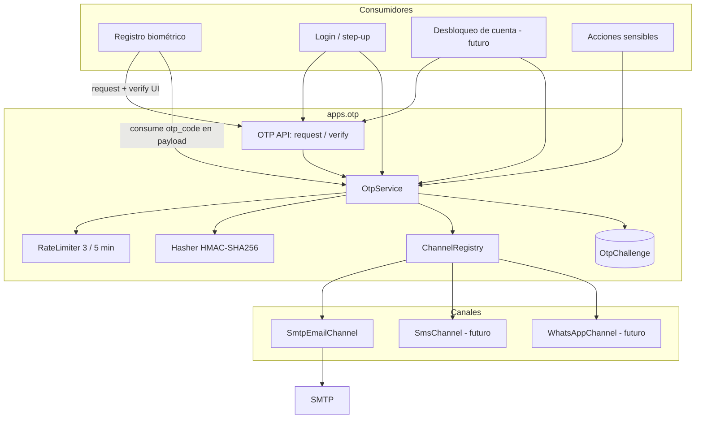
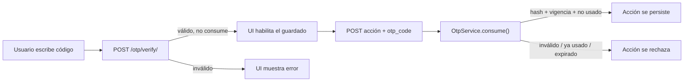
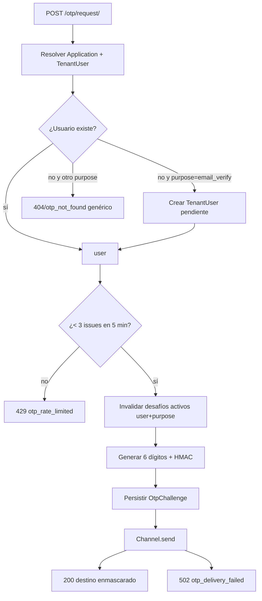
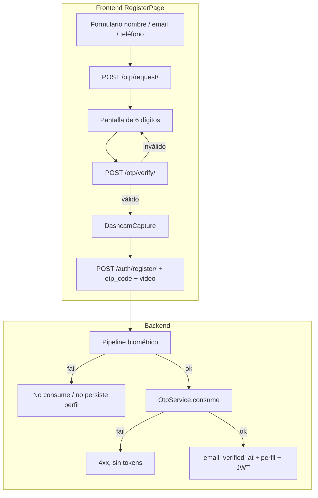
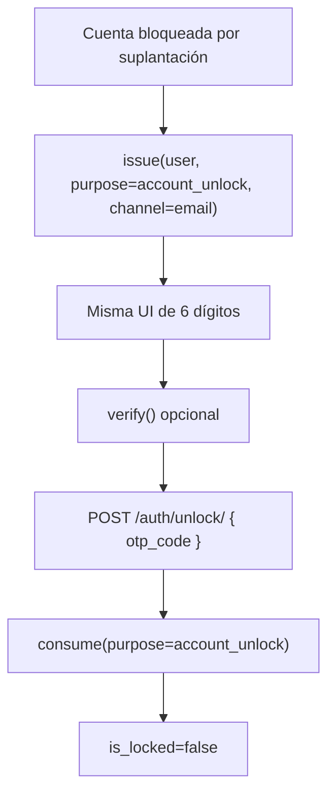

# Capa OTP — Prevención de Account Takeover

> Estado: **implementado** (Fase 9). Conclusiones: [`OTP_IMPLEMENTATION.md`](OTP_IMPLEMENTATION.md).  
> Cómo enganchar un feature nuevo: [`OTP_FEATURE_GUIDE.md`](OTP_FEATURE_GUIDE.md).  
> Relacionado: [`ARCHITECTURE.md`](ARCHITECTURE.md), [`MASTER_PLAN.md`](MASTER_PLAN.md).
>
> Decisiones cerradas: primer consumidor = registro; usuario pendiente al `request`; 5 intentos de verify; SMTP + console en local; `consume` después del pipeline biométrico OK.

Este documento define una capa reutilizable de One-Time Passwords (OTP) para mitigar *account takeover* (ATO). El primer canal es correo SMTP; el diseño admite SMS, WhatsApp u otros sin cambiar a los consumidores.

---

## 1. Problema

Face-Auth autentica usuarios finales (`TenantUser`) solo con biometría. El email se captura en el registro y es la identidad lógica del usuario (único por tenant), **pero no se verifica**.

Vectores de ATO relevantes:

| Vector | Hoy | Cómo ayuda el OTP |
|---|---|---|
| Enrolar un rostro ajeno usando el email de la víctima | Posible: el registro no prueba posesión del buzón | OTP al email **antes** de persistir el enrolamiento |
| Re-enrolamiento / cambio de email sin prueba de posesión | No hay self-service; el admin puede PATCH email sin segundo factor | Mismo servicio OTP con otro `purpose` |
| Desbloqueo de cuenta tras intentos de suplantación | Fuera del alcance de esta tarea | Mismo servicio OTP (`purpose=account_unlock`) |

El login biométrico **no** se reemplaza. El OTP es un factor de *posesión del canal* (email hoy), no un segundo factor biométrico.

---

## 2. Requerimientos (esta tarea)

| # | Requisito | Decisión de diseño |
|---|---|---|
| R1 | Código numérico de 6 dígitos | `secrets.randbelow(1_000_000)` con padding a 6 caracteres |
| R2 | Canal inicial SMTP, extensible | Protocolo `NotificationChannel` + registro por nombre |
| R3 | Rate limit de generación: máximo 3 códigos cada 5 min | Límite de dominio por `(usuario, purpose)`, no solo por IP |
| R4 | TTL 5 min, configurable | `OTP_TTL_SECONDS` (default `300`) |
| R5 | Cada código nuevo invalida el anterior | Soft-invalidate del desafío activo del mismo `(user, purpose)` |
| R6 | Código atado al usuario | FK obligatoria a `TenantUser` (ver §6.2 para el caso registro) |
| R7 | Validación en UI **y** al guardar; el código va en el payload de guardado | `verify()` no consume; `consume()` es atómico en la acción |
| R8 | Reutilizable (p. ej. desbloqueo por suplantación) | `purpose` tipado; API genérica; mixin de consumo |

Fuera de alcance (explícito): bloqueo de cuenta por intentos de suplantación. La capa debe poder usarse después sin rediseño.

---

## 3. Estado actual del código

No existe infraestructura de mensajería ni verificación:

- Sin `EMAIL_*` en settings, sin plantillas, sin `django-anymail`.
- Sin modelos de código/desafío.
- `TenantUser` no tiene `email_verified_at`.
- El throttle existente (`AppIdScopedRateThrottle`) cubre login/registro biométrico por `app_id` + IP (`30/min`); no sirve como límite de 3/5 min por usuario.
- El patrón más cercano a “un solo uso” es el `jti` del `SSORedirectToken` consumido en cache (`TokenVerifyView`).

Punto de enganche natural del primer consumidor: `POST /api/v1/auth/register/` y el wizard de `RegisterPage` (formulario → cámara). Hoy el registro es un único `multipart` (perfil + video).

---

## 4. Principios

1. **El OTP no es un flujo: es un servicio.** Login, registro, desbloqueo y acciones sensibles *consumen* el servicio; no implementan OTP cada uno.
2. **Nunca persistir el código en claro.** Solo el hash HMAC-SHA256 (pepper = `SECRET_KEY` o `OTP_PEPPER`).
3. **Verify ≠ consume.** La UI puede comprobar el código para UX; el guardado es la única operación que lo marca usado. Así el payload de la acción lleva `otp_code` y el servidor no confía en el cliente.
4. **Un desafío activo por `(user, purpose)`.** Un resend mata el código anterior (R5). Distintos `purpose` no se pisan (un unlock no invalida un email-verify).
5. **Respuestas uniformes** `{code, message, field}` como el resto de la API.
6. **No enumerar usuarios.** `request` responde igual si el email existe o no (mensaje genérico + destino enmascarado cuando aplica).
7. **Síncrono en v1.** No hay Celery. El envío SMTP es síncrono con timeout; el canal queda detrás de la misma interfaz para pasar a cola después.

---

## 5. Arquitectura propuesta

Nueva app Django `apps.otp`, desacoplada de biometría y de JWT. Los consumidores (authentication, accounts, un futuro lockout) llaman a `OtpService`.



Regla de dependencia: `apps.otp` puede conocer `TenantUser`. `apps.authentication` y futuros módulos conocen `OtpService`. Los canales no conocen a los consumidores.

---

## 6. Modelo de datos

### 6.1 `OtpChallenge`

Tabla `otp_challenge`:

| Campo | Tipo | Notas |
|---|---|---|
| `id` | UUID PK | Id de desafío (útil en logs; no es secreto) |
| `user` | FK `TenantUser` | R6: siempre ligado a un usuario |
| `application` | FK `Application` | Denormalizado para queries multi-tenant |
| `purpose` | `CharField` + choices | Ver §6.3 |
| `channel` | `CharField` | `email` hoy; `sms` / `whatsapp` después |
| `destination_hash` | `CharField` | Hash del destino (email/teléfono) para auditoría sin PII extra |
| `code_hash` | `CharField` | HMAC del código de 6 dígitos |
| `expires_at` | DateTime | `now + OTP_TTL` |
| `consumed_at` | DateTime null | Seteado solo en `consume()` |
| `verified_at` | DateTime null | Seteado en `verify()` de UI (no impide `consume`) |
| `attempt_count` | PositiveInt | Fallos de verificación |
| `invalidated_at` | DateTime null | Código reemplazado o bloqueado por intentos |
| `created_at` | DateTime | Base del rate limit de emisión |

Índices recomendados:

- `(user, purpose, created_at DESC)` — desafío vigente + rate limit.
- `(user, purpose)` filtrando `consumed_at IS NULL AND invalidated_at IS NULL`.

Un desafío está **activo** si:

```text
consumed_at IS NULL
AND invalidated_at IS NULL
AND expires_at > now()
```

### 6.2 Ligadura al usuario en el registro

En el registro el `TenantUser` **aún no existe**. **Decisión: crear un `TenantUser` pendiente al solicitar el OTP**, sin perfil biométrico:

1. Formulario (nombre, email, teléfono) → `POST /otp/request/` con `purpose=email_verify`.
2. Si no hay usuario: se crea `TenantUser` con `is_active=False` (o flag `email_verified_at=NULL`).
3. El código queda atado a ese `user_id`.
4. El guardado biométrico (`POST /auth/register/`) exige `otp_code`, hace `consume()`, enrola y activa.

El login biométrico no matchea a un pendiente (no hay `BiometricProfile` activo). El constraint `uniq_email_per_app` impide un segundo registro con el mismo email.

Campo nuevo en `TenantUser`:

```text
email_verified_at = DateTimeField(null=True, blank=True)
```

`consume(purpose=email_verify)` setea `email_verified_at` si aún es null. No se emiten tokens SSO a un usuario sin verificación cuando el consumidor lo exija.

### 6.3 `purpose` (extensibilidad)

```text
email_verify      # registro / prueba de posesión del buzón
step_up           # confirmación puntual de una acción ya autenticada
account_unlock    # futuro: desbloqueo por intentos de suplantación
email_change      # futuro: confirmar el nuevo email
reenrollment      # futuro: re-captura biométrica
```

Añadir un purpose nuevo **no** cambia el modelo ni la API genérica; solo un consumidor nuevo llama `issue` / `verify` / `consume` con ese valor.

---

## 7. Contrato de servicio

`OtpService` es la única puerta de escritura. Las vistas OTP y los consumidores de guardado no tocan el modelo directo.

```text
issue(user, purpose, channel="email") -> IssueResult
    - aplica rate limit 3 / 5 min
    - invalida desafíos activos del mismo (user, purpose)
    - genera código, guarda hash, envía por el canal
    - retorna { challenge_id, expires_at, destination_masked, retry_after? }

verify(user, purpose, code) -> None
    - localiza el desafío activo
    - compara hash en tiempo constante
    - si falla: incrementa attempt_count; si supera el máximo, invalida
    - si ok: setea verified_at (idempotente)
    - NO setea consumed_at

consume(user, purpose, code) -> OtpChallenge
    - mismas comprobaciones que verify (código vigente, hash, intentos)
    - transacción: consumed_at = now(); side-effects del consumidor fuera o en la misma tx
    - un código ya consumido / invalidado / expirado falla
```

`verify` es opcional para la seguridad: un cliente que salte la UI y mande el código directo al guardado sigue pasando por `consume`. La UI no es un factor de confianza.

### 7.1 Por qué no consumir en la UI

Si `verify` consumiera el código, el payload de guardado no podría revalidarlo (R7). Alternativa descartada para v1: emitir un `otp_proof` JWT de corta vida y mandarlo al guardar. Cumple doble chequeo, pero **no** pone el código en el payload, que es un requisito explícito.



---

## 8. API HTTP

Prefijo: `/api/v1/otp/`. Errores con el shape existente `{code, message, field}`.

### 8.1 Solicitar código

```http
POST /api/v1/otp/request/
Content-Type: application/json

{
  "app_id": "app_…",
  "purpose": "email_verify",
  "channel": "email",
  "email": "user@example.com",
  "first_name": "Ana",
  "last_name": "Pérez",
  "phone": ""
}
```

`first_name` / `last_name` / `phone` aplican solo cuando el purpose crea usuario pendiente (`email_verify`). Para un usuario ya autenticado, el destino sale del `TenantUser` y no se acepta un email arbitrario.

Respuesta `200` (siempre genérica ante enumeración):

```json
{
  "challenge_id": "uuid",
  "expires_in": 300,
  "destination_masked": "u***@example.com",
  "channel": "email"
}
```

Rate limit superado → `429`:

```json
{
  "code": "otp_rate_limited",
  "message": "Demasiados códigos solicitados. Intenta de nuevo en unos minutos.",
  "field": null
}
```

Cabecera `Retry-After` en segundos.

### 8.2 Verificar en UI (no consume)

```http
POST /api/v1/otp/verify/

{
  "app_id": "app_…",
  "purpose": "email_verify",
  "email": "user@example.com",
  "code": "123456"
}
```

Éxito `200`: `{ "valid": true, "expires_in": 184 }`.

Fallo `400` / `422`:

| `code` | Cuándo |
|---|---|
| `otp_invalid` | Código incorrecto (mensaje genérico) |
| `otp_expired` | TTL vencido |
| `otp_consumed` | Ya usado en un guardado |
| `otp_locked` | Superó intentos de verificación (recomendado: 5) |
| `otp_not_found` | No hay desafío activo |

No distinguir “código incorrecto” vs “no existe desafío” hacia el cliente si eso filtra estado; internamente sí se loguea.

### 8.3 Guardado (consumidor)

El endpoint de la acción **incluye** el código. Ejemplo registro:

```http
POST /api/v1/auth/register/
Content-Type: multipart/form-data

app_id, first_name, last_name, email, phone, video, redirect_uri, otp_code
```

El serializer exige `otp_code` (6 dígitos). La vista, **dentro de la misma transacción** que el enrolamiento:

1. Resuelve `TenantUser` por `(application, email)`.
2. `OtpService.consume(user, purpose="email_verify", code=otp_code)`.
3. Si consume falla → no se guarda el perfil biométrico.
4. **Decisión Q6:** `consume` corre **después** de liveness/calidad OK y **antes** de persistir el perfil y emitir JWT. Un video rechazado no quema el OTP.

Helper reutilizable:

```python
class ConsumesOtpMixin:
    otp_purpose: str

    def consume_otp_or_raise(self, user: TenantUser, code: str) -> None:
        OtpService.consume(user=user, purpose=self.otp_purpose, code=code)
```

---

## 9. Flujos

### 9.1 Emisión (issue)



### 9.2 Registro con doble validación (primer consumidor propuesto)



### 9.3 Reutilización futura: desbloqueo de cuenta

Fuera de alcance, ilustra por qué `purpose` y el mixin bastan:



No hace falta otra tabla ni otro canal. Solo un purpose, un endpoint consumidor y, si se quiere, el mismo componente React `OtpChallengeForm`.

---

## 10. Canales

```text
class NotificationChannel(Protocol):
    name: str  # "email" | "sms" | "whatsapp"

    def send(self, *, destination: str, purpose: str, code: str, context: dict) -> None:
        ...
```

| Canal | v1 | Implementación |
|---|---|---|
| `email` | Sí | `SmtpEmailChannel` vía `django.core.mail` + plantilla HTML/texto |
| `sms` | No | Stub / no registrado |
| `whatsapp` | No | Stub / no registrado |

`ChannelRegistry.get(name)` lanza `otp_channel_unsupported` si el canal no está activo.

Settings:

```text
OTP_TTL_SECONDS=300
OTP_ISSUE_MAX=3
OTP_ISSUE_WINDOW_SECONDS=300
OTP_VERIFY_MAX_ATTEMPTS=5          # acordado: 5 fallos → otp_locked
OTP_PEPPER=                        # default SECRET_KEY
EMAIL_BACKEND=django.core.mail.backends.smtp.EmailBackend
EMAIL_HOST / EMAIL_PORT / EMAIL_HOST_USER / EMAIL_HOST_PASSWORD
EMAIL_USE_TLS=True
DEFAULT_FROM_EMAIL=Face-Auth <noreply@…>
```

Desarrollo: `EMAIL_BACKEND=django.core.mail.backends.console.EmailBackend` (el código sale en el log del backend, no se manda red). Tests: `locmem`.

Envío síncrono en el request de `issue`. Si SMTP falla, el desafío **sí** queda persistido e invalidado el anterior: un retry cuenta contra el rate limit. Alternativa: persistir solo tras envío OK (recomendado: **persistir antes y marcar `delivery_failed`**, para no reutilizar un código que el usuario nunca recibió si el mail sí salió y la respuesta HTTP se perdió). Ver §13 Q5.

---

## 11. Seguridad

| Control | Detalle |
|---|---|
| Código impredecible | `secrets`, 10^6 combinaciones; viable solo con rate limit de **verificación** |
| Hash | HMAC-SHA256(`OTP_PEPPER`, `f"{user_id}:{purpose}:{code}"`) — el code solo no basta si hay fuga de hashes |
| Comparación | `hmac.compare_digest` |
| Un código vivo | Invalidación del anterior en `issue` |
| Issue rate limit | 3 / 5 min por `(user_id, purpose)` en DB (`COUNT` de `created_at`) |
| Verify rate limit | Máximo de intentos por desafío + throttle IP de cortesía (p. ej. 10/min) |
| TTL | 5 min default |
| No logs de código | Ni en exception messages ni en emails de error |
| Enumeración | Misma respuesta en request; destino enmascarado |
| Multi-tenant | `application` + email únicos; un OTP de app A no vale en app B |
| Timing | Respuesta de verify con trabajo constante razonable (siempre lookup + compare) |

Un código de 6 dígitos sin tope de intentos se brute-forcea. **R3 solo limita la emisión.** Por eso se recomienda `OTP_VERIFY_MAX_ATTEMPTS=5` y, al superarlo, invalidar el desafío (`otp_locked`) hasta un nuevo `issue`.

Throttle IP adicional (DRF) evita abuso de `request` contra emails distintos desde la misma IP; es complementario, no sustituye el límite por usuario.

---

## 12. Frontend

Componente reutilizable (p. ej. `OtpChallengeForm`) usado por registro hoy y por unlock mañana:

- 6 inputs numéricos (patrón shadcn / Radix; ya hay primitivos transitivos en el lockfile).
- Countdown de TTL y de resend (el resend llama otra vez a `/otp/request/` y está sujeto a 3/5 min).
- Destino enmascarado.
- `verify` al completar los 6 dígitos (debounce / submit explícito).
- El código **se conserva en memoria del wizard** para incluirlo en el `FormData` de register; no se guarda en `sessionStorage`.

Cambio en `RegisterPage`:

```text
paso 1  datos de perfil
paso 2  OTP email          ← nuevo
paso 3  DashcamCapture
```

Si el usuario refresca en el paso 3, debe volver a pedir/verificar OTP (el código no se persiste en el cliente). Aceptable dado TTL 5 min.

Contrato: regenerar `schema.json` + `bun run generate:api` como el resto de endpoints.

---

## 13. Decisiones

| # | Pregunta | Decisión |
|---|---|---|
| Q1 | Primer consumidor | **Solo registro** (`purpose=email_verify`). El login biométrico no cambia. |
| Q2 | Usuario que aún no existe | **`TenantUser` pendiente** (`is_active=False`) al `request`; el OTP se ata a ese `user_id`. |
| Q3 | Tope de verificación | **5 intentos** por desafío; al superarlo → `otp_locked` hasta un nuevo `issue`. |
| Q4 | Correo | **SMTP genérico** (`EMAIL_HOST*`) en prod; **console backend** en local. |
| Q5 | SMTP falla tras invalidar el código anterior | **Persistir el desafío** y devolver `otp_delivery_failed`. El resend cuenta contra el rate limit. *(default de diseño, no contradicho)* |
| Q6 | Momento de `consume` en registro | **Después** del pipeline biométrico OK, **antes** de persistir perfil y emitir JWT. |
| Q7 | OTP para operadores admin | **Fuera de alcance.** El servicio es para `TenantUser`. *(default de diseño)* |
| Q8 | Enmascarar destino | **Sí**, `u***@dominio.com`. *(default de diseño)* |

---

## 14. Plan de implementación

Orden sugerido, alineado al estilo contract-first del repo:

1. App `apps.otp`: modelo, migración, `OtpService`, hasher, rate limit de dominio, `SmtpEmailChannel`, plantillas.
2. Settings `OTP_*` + `EMAIL_*` en `base.py` / `.env.example`; console backend en `dev.py`.
3. Endpoints `POST /otp/request/` y `POST /otp/verify/` + errores en spectacular.
4. Campo `otp_code` en `RegisterRequestSerializer`; `RegisterView` llama `consume` (según Q6).
5. `email_verified_at` en `TenantUser`.
6. Frontend: paso OTP + componente reutilizable; `otp_code` en el `FormData` de register.
7. Tests unitarios del servicio (issue/invalidate/ttl/rate-limit/verify/consume) + integración API + un test del wizard.
8. Regenerar `schema.json` y tipos TS.
9. Actualizar `ARCHITECTURE.md` y marcar fase en `MASTER_PLAN.md` cuando se implemente.

No se toca el pipeline biométrico ni la emisión JWT más que para exigir consume exitoso en el consumidor elegido.
